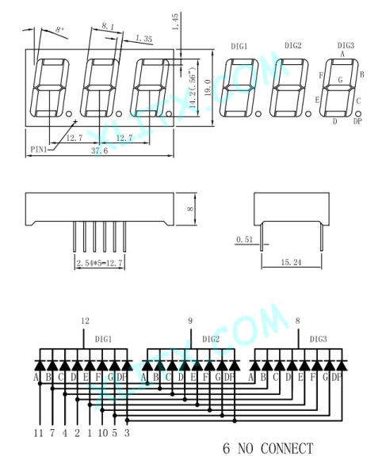
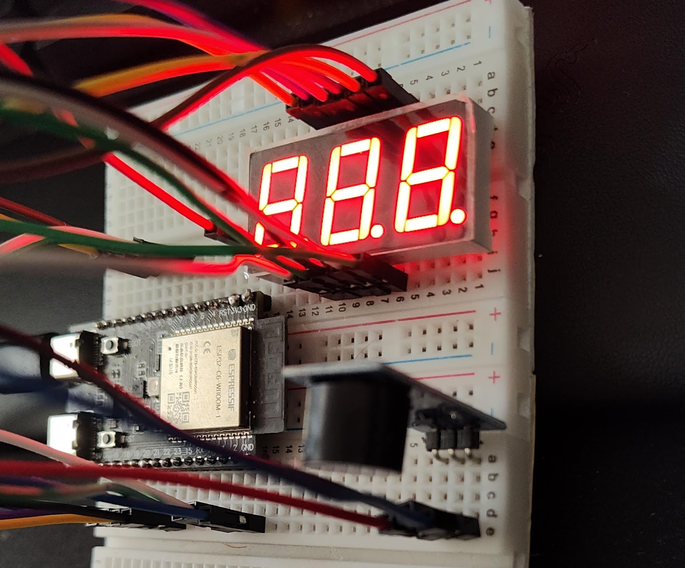

# 7 Segment 3 digit display no driver

One Pin is also a simple beeper to be used to test of IO is working.

## Model

```text
Model : 5631AS
Size : 0.56-inch
Emitting color : Red (Ultra-Bright ) 
Mode : Common-Cathode (CC)
Digit : 3-Digit
Category : LED 7-Segment Display 
Maker : XLITX Technology
```

## Pin



Start from `PIN 1` - move to top counterclockwise:

```text
 12 11 10 9 8 7
  1  2  3 4 5 (6 absent)
```
## Detailed

Pins correspond to

- Segment (A-G)
- Dot (PD)
- Digit (DIG1-3)


```text
E    - 1
D    - 2
DP   - 3
C    - 4
G    - 5
       6 - pin is not used or absent
B    - 7
DIG3 - 8
DIG2 - 9
F    - 10
A    - 11
DIG1 - 12
```

## Usage help


### Select digit

Select digit to activate led from 1-3
Pin number - On\Off state

```text

Show any integer at DIG3
 8 (DIG3)   - 0 
 9 (DIG2)   - 1
 12 (DIG1)  - 1

Show any integer at DIG2 and DIG3
 8 (DIG3)   - 0 
 9 (DIG2)   - 0
 12 (DIG1)  - 1

Show any integer at DIG1, DIG2 and DIG3
 8 (DIG3)   - 0 
 9 (DIG2)   - 0
 12 (DIG1)  - 0
```

Can be used in any reading direction Start-End or End-Start.

### Draw integer

Show 8 three times for debug display

```text
Activate all 3 digits
 8 (DIG3)   - 0 
 9 (DIG2)   - 0
 12 (DIG1)  - 0

Draw 8 (pins sorted alphabetically)
 A (11)     - 1
 B (7)      - 1
 C (4)      - 1
 D (2)      - 1
 E (1)      - 1
 F (10)     - 1
 G (5)      - 1
```

### Draw dot

Same as before, for `pin 3` - swich to ON

```text
 DP (3) - 1
```

# DEMO

Use this YAML to test the display and check pinout.
It's not ready to show real symbols or numbers, it's just a demo.


[YAML For ESPHome test](esphome/esp32-c6-2_7seg_display.yaml)

- Use switches to test all options.

## ESP IDF

Required: 
 `idf.py add-dependency "espressif/led_strip^3.0.1"`

[main.c file for ESP IDF](main.c)

- Count works, but I have not yet get it to show all three digists! It interrupts in the cycle, I need to figure out it.


